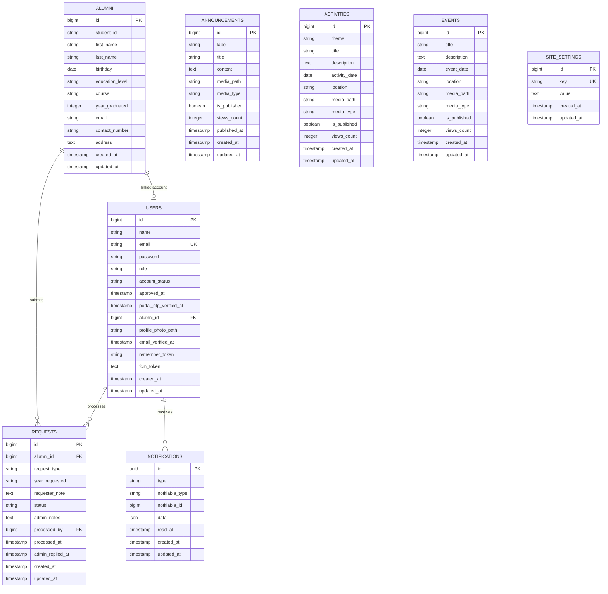
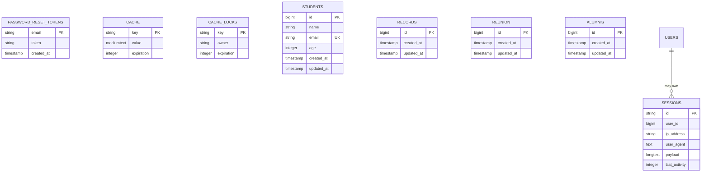

# Alumni Link ERD

This ERD is based on the Laravel migrations and Eloquent models in this repository.

## Main Application Tables

## Framework And Legacy Tables

## Relationship Notes

- `alumni.id` to `users.alumni_id` is optional one-to-one. One alumni record can have one linked portal user account.
- `users.portal_otp_verified_at` is set only after an alumni user successfully verifies the Gmail OTP on first login. New or newly approved alumni accounts keep this value null until that first-login verification is completed.
- `alumni.id` to `requests.alumni_id` is one-to-many. Deleting an alumni record cascades and deletes related requests.
- `users.id` to `requests.processed_by` is optional one-to-many. If the processing admin user is deleted, `processed_by` is set to null.
- `notifications` uses Laravel's polymorphic `notifiable_type` and `notifiable_id`. In this system, notifications are sent to users through the `User` model.
- `announcements`, `activities`, `events`, and `site_settings` are standalone content/configuration tables in the current schema.
- `students`, `records`, `reunion`, and `alumnis` appear to be early scaffold or legacy tables because the active models/controllers use `alumni`, `users`, `requests`, `announcements`, `activities`, `events`, and `site_settings`.
